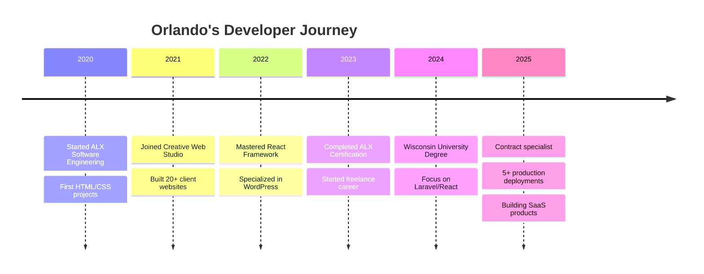

#  Hello World, I'm Orlando Gift

<div align="center">
  
</div>

<div align="center">
  
[](mailto:giftaterezi@gmail.com)
[](https://orlandogift.dev)
[](https://wa.me/233531804962)
[](https://github.com/orlandogift)

</div>


## 👨‍💻 Professional Profile

```typescript
class WebDeveloper {
  name = 'Orlando Gift Aterezi';
  location = 'Accra, Ghana 🇬🇭';
  experience = '4+ years';
  
  expertise = {
    frontend: ['React', 'JavaScript', 'HTML5', 'CSS3', 'Responsive Design'],
    backend: ['Laravel', 'PHP', 'REST APIs', 'MySQL'],
    cms: ['WordPress', 'Custom Themes', 'Plugin Development'],
    tools: ['Git', 'Figma', 'Webpack', 'npm', 'Chrome DevTools']
  };
  
  currentFocus = ['Next.js', 'TypeScript', 'Performance Optimization'];
  availability = 'Open for exciting projects! 🚀';
}
```


## 🛠️ Technology Arsenal

<div align="center">

### Frontend Magic ✨


### Backend Power 💪


### Tools & Platforms 🔧


</div>


## 🚀 Flagship Projects

<div align="center">
<table>
<tr>
<td width="50%">

### 🏠 Lush Homes
**Rental & Short-Stay Platform**
- Full Airbnb-style functionality
- Property listings with filters
- Complete booking system
- Mobile-first responsive design
- **Tech:** React, Laravel, MySQL
- **Live:** [lushhomesgh.com](https://lushhomesgh.com)

</td>
<td width="50%">

### ⚖️ Ustar Law Group
**Professional Legal Services**
- Custom WordPress theme
- SEO optimized (98 Lighthouse)
- Security hardening
- Schema markup implementation
- **Tech:** WordPress, PHP, Custom CSS
- **Live:** [ustarlawgroup.co.uk](https://ustarlawgroup.co.uk)

</td>
</tr>
<tr>
<td width="50%">

### ⚡ KG Electrical
**Contractor Services Platform**
- Service catalog system
- Quote request functionality
- Client testimonials
- Analytics integration
- **Tech:** WordPress, JavaScript
- **Live:** [kgelectricalcontractors.co.uk](https://kgelectricalcontractors.co.uk)

</td>
<td width="50%">

### 📋 Taskly
**Project Management Tool**
- Drag-and-drop Kanban boards
- Real-time search & filters
- User authentication
- REST API integration
- **Tech:** React, Context API
- **Status:** v1.2 in development

</td>
</tr>
</table>
</div>


## 📊 GitHub Analytics Dashboard

<div align="center">
  
### 📈 Performance Metrics


### 🔥 Contribution Streak


### 🏆 Achievement Trophies


</div>


## 💼 Professional Timeline




## 🎯 2025 Objectives

<div align="center">

| Goal | Progress | Status |
|------|----------|--------|
| Master TypeScript | ████████░░ 80% | 🔄 In Progress |
| Learn Next.js | ██████░░░░ 60% | 📚 Learning |
| Build SaaS Product | ███░░░░░░░ 30% | 📝 Planning |
| Open Source Contribution | █████████░ 90% | ✅ Active |
| Deploy 10 Projects | ████████░░ 80% | 🚀 8/10 Done |

</div>


## 📞 Let's Build Something Amazing!

<div align="center">
  
### 💬 Quick Response Time: < 24 hours

I'm passionate about creating digital experiences that make a difference. Whether you need a complete web application, WordPress customization, or React components, I'm here to help bring your vision to life.

**📧 Email:** giftaterezi@gmail.com  
**📱 WhatsApp:** +233 531 804 962  
**💼 Status:** Available for contracts

</div>


<div align="center">
  
### 📌 Visitor Count


### 💻 Coding Activity
[](https://wakatime.com/@orlandogift)

</div>


<div align="center">
  <b>⚡ "First, solve the problem. Then, write the code." - John Johnson</b>
</div>
